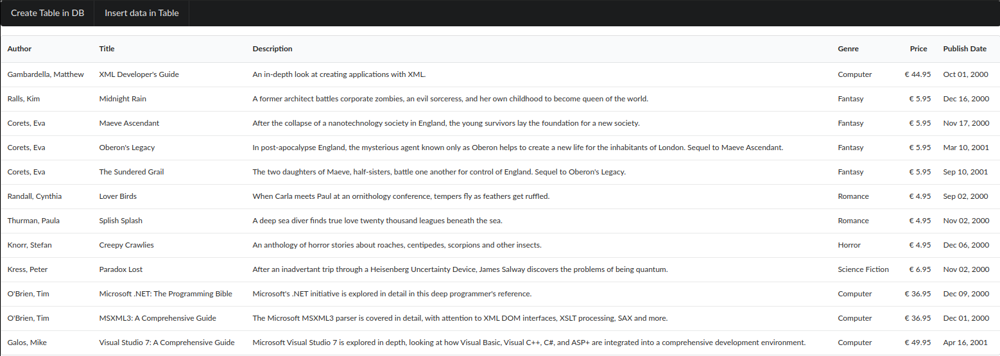

# atk4-playground

Open a terminal and execute this commands below :

`composer update`

`php -S 127.0.0.1:8080`

### XML example

- Define a model
- Read an XML file
- Show XML data
- Add button to create table DB
- Populate table DB

open browser on 127.0.0.1:8080/xml/

